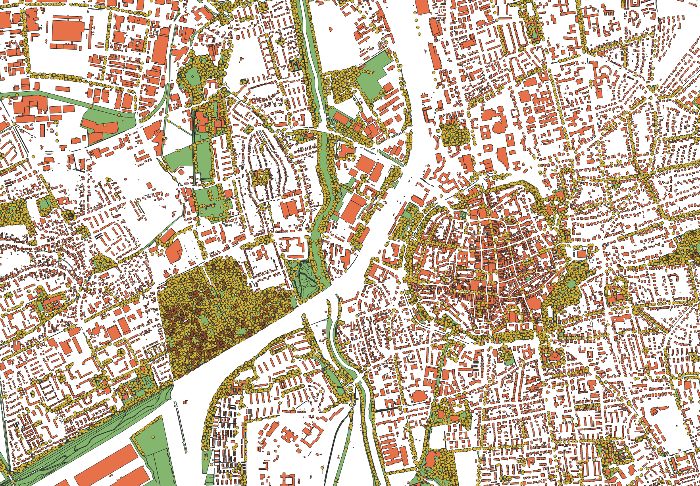

```{=html}
<!--

Skripte für die Übungen 04 des Moduls UWPM-GIS im Studiengang
M.Sc. urbanes Baum- und Waldmanagement der HAWK Göttingen.

Autor: Paul Magdon
Datum: 2026-04-21
Lizenz: Creative Commons BY-NC-SA 4.0 https://creativecommons.org/licenses/by-nc-sa/4.0/

-->
```

# Lerneinheit 04: Analyse der Verteilung der Stadtbäume in Göttingen

{fig-align="center"}

## Lernziele & Aufgabenstellung

**Lernziele**

Die Studierenden sollen:

-   Daten mithilfe von SQL-Befehlen zu filtern
-   räumliche abfragen mit spatial SQL durchzuführen

**Aufgaben**

1.  Importieren sie die Layer aus einem Geopackage

2.  Passen sie die Symbolisierung so an, dass alle Geodaten sinnvoll und übersichtlich dargestellt
    werden

3.  Filtern Sie die Daten auf Grundlage von Attributen mit SQL

4.  Filter Sie die Daten mihilfe räumlicher SQL Abfragen

## Anlegen eine neuen QGIS-Projektes

Folgen sie der Anleitung aus @sec-projekt_management um eine neue Ordnerstruktur und ein neues
QGIS-Projekt für LE02 anzulegen.

## Import der Geodaten
